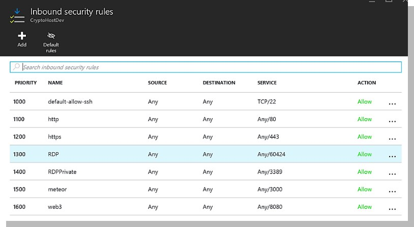

# Building First Smart-Contract for Real Estate Use Case
## Hands-On Lab

### Preparing Infrastructure
1. Get Azure Pass
  - Instruction https://www.microsoftazurepass.com/Home/HowTo
3. Create a Linux virtual machine with the Azure portal
  - Log in to Azure http://portal.azure.com
  - Create Virtual Machine
      - Click the New button found on the upper left-hand corner of the Azure portal.
      - Select `Compute`, select `Ubuntu Server 16.04 LTS`, and ensure that `Resource Manager` is the selected deployment model.
      - Click the `Create` button.
      - Enter the virtual machine information
        - VM disk type 
        - Select SSD
        - For Authentication type, select Password 
      - Remember VM name , admin and password for the future use
      - Create new Resource Group
      - Select West Europe Location 
      - Click `Ok`
  - Select a size for the VM
      - DS2_V2
      - Click `Select`
  - Make IP static 
      - Click on `Public IP address`
      - Select `Static`
      - Click `Ok`
  - Setup Network security group
      - Click on `Network security group` (firewall) 
      - Open `ports` in `Inbound Rules`
      - Open the following ports


  - Check summary
      - Click Ok
  - Deployment process will be started
  - After deployment succeed
      - Click on Resource Groups
      - Click on Resource Group Name you created
      - Find Virtual machine by name and click on it
      - Find Public IP address 
  - Copy IP address for future use
  
### Preparing Dev Environment 
  - For Windows 10 users use in Bash Windows subsystem for Linux (will be used for this lab) or Putty
  - Open Bash command line
      - Input command `ssh adminname@IP_of_Azure_VM`
      - Input password
  - Install Node.js
      - `curl -sL https://deb.nodesource.com/setup_6.x | sudo -E bash -`
      - `sudo apt-get install nodejs`
      - `npm -v`
      - NPM Ver should be `3.10.10`
  - Install required packages 
      - `sudo apt-get install -y build-essential`
  - Clone repository with Reals Estate Lab
      - `git clone https://github.com/bashalex/devcon.git`
      - `ls`
      – Make sure that folder `devcon` exists
  - Go to the Lab directory
      -  `cd ~/devcon`
  - Install Truffle & TestRpc
      - `sudo -H npm  install -g truffle`
      - `sudo -H npm  install -g truffle-default-builder`
      - `sudo -H npm  install -g ethereumjs-testrpc`
  - Check that `testRPC` works
      - `./run_testrpc.sh`
      - You should see the following:
          - 3 Available Accounts 
          - 3 Private Keys
          - Listening on localhost:8545
      - Click double `Ctrl – C` to stop `testRPC`

### Deployment and Configuration 
  - Open new Bash and connect to Azure VM
      - `cd devcon/contracts/`
      - `cat RealEstateRegistry.sol`
      - Copy & Past code of Smart Contract
  - Open Remix, Visual Studio Code or another IDE
      - Paste the code of Smart-Contract for overview 

### Understating EVM via using in Node
  - `cd ~/devcon`
  - Make sure that `testRPC` works in the other tab
  - `node`
      - `web3 = require('web3');`
      - `web3 = new web3(new web3.providers.HttpProvider("http://localhost:8545"));`
      - `web3.eth.accounts`
      - `code = fs.readFileSync('contracts/RealEstateRegistry.sol').toString()`
      - `contract =  web3.eth.compile.solidity(code);` //contract.code: contract.info.abiDefinition:
      - `RealEstContract = web3.eth.contract(contract.info.abiDefinition);` //Application Binary Interface
      - `deployedContract = RealEstContract.new(['estate_name1','estate_name2','estate_name3', web3.eth.accounts[0], web3.eth.accounts[0], web3.eth.accounts[0], web3.eth.accounts[2]],{data: contract.code, from: web3.eth.accounts[0], gas: 4700000})`
      - `contractInstance =RealEstContract.at(deployedContract.address);`

### Building first Smart-Contract and running End- To- End Real Estate Scenario
*Two Bash command line required. One is for running TestRPC and other for running commands below*
  - `cd ~/devcon`
  - `rm -r build/` // clean truffle dev environment 
  - `truffle migrate`
  - Copy address from RealEstateRegistry output:
      - `Deploying RealEstateRegistry...`
      - `RealEstateRegistry: 0xd0957deff78e0f87d949c1a08464af9c6d34a75c`
  - `truffle console`
      - `var status = {0: 'Owned', 1: 'On Sale', 2: 'Await Confirmation'};`
      - `function printEstate(estate) {console.log(' - Real Estate with id ' + estate[0] + '\n\tname: ' + estate[1] + '\n\tprice: ' + web3.fromWei(estate[2], 'Ether') + ' eth\n\tstatus: ' + status[estate[3]] + '\n\towner: ' + estate[4], '\n\tpotential owner: ' + estate[5]); };`
      - `web3.eth.accounts`
      - `var seller = web3.eth.accounts[0];`
      - `var buyer = web3.eth.accounts[2];`
      - `var inspector = web3.eth.accounts[1];`
      - `var contract = RealEstateRegistry.at('0xd0957deff78e0f87d949c1a08464af9c6d34a75c');`  // put actual contract address
      - `contract.getEstate.call(1).then(function(estate) { printEstate(estate); });`
    
      - #### Put apartment #1 on sale:
      - `contract.sell(1,web3.toWei(10,'Ether'),{from:'0xaec3ae5d2be00bfc91597d7a1b2c43818d84396a', gas: 10000});`  // you could error for not enough GAS for the transaction 
      - `contract.sell(1,web3.toWei(10,'Ether'),{from:'0xaec3ae5d2be00bfc91597d7a1b2c43818d84396a', gas: 41494});`
      - `contract.getEstate.call(1).then(function(estate) { printEstate(estate); });`  //to see details of  estate ID #1 

      - #### Buy apartment #1:
      - `contract.buy(1, { from:buyer });`
      - `contract.getEstate.call(1).then(function(estate) { printEstate(estate); });`
      - #### Confirm the deal by inspector:
      - `contract.confirm(1, {from:buyer});`  //you could get error since only inspector can confirm
      - `contract.confirm(1, {from:inspector});`
      - `contract.getEstate.call(1).then(function(estate) { printEstate(estate); });`
      - `web3.eth.accounts`  // review addresses and check that the ownership was done correctly

### Working with Ethereum via Truffle
  - `cd ~/devcon`
  - `cat truffle.js` // project configuration file
  - `cat test/tests.js`  // test overview
  - `truffle compile` // compile contracts
  - `truffle migrate` // deploy contracts to the network
  - `truffle test` // compile, deploy and auto test
  
### Task
Get amount of money sent with current transaction:
```
uint256 amountReceived = msg.value;  // in Wei
```
Send money to somebody else:
```
address guy1 = 0xdeadbeef.....;
uint256 amountToSend = 10 ether;
guy1.send(amountToSend);
```

We've noticed that some of the tests do not work. The problem
that we do not really send any money from buyer to seller. Let's fix it!

We need to implement the following:
  - send money (ethers) with `buy` function call
  - validate that buyer sent correct amount (equal to appartment price)
  - send 95% of the price to the seller when inspector confirms the deal
  - send 5% to inspector as a fee
 
Make sure that all tests work now!

### Deploy to public test network (kovan)
  - `cd ~/devcon`
  - `rm -r build`
  - `truffle migrate --network kovan`
  - check deployed contract at https://kovan.etherscan.io

### Serve UI
  - `cd ~/devcon`
  - `rm -r build`
  - `truffle build`
  - `truffle migrate`
  - `trufle serve`
  - open `AZURE_VM_IP:8080` in your browser
 
